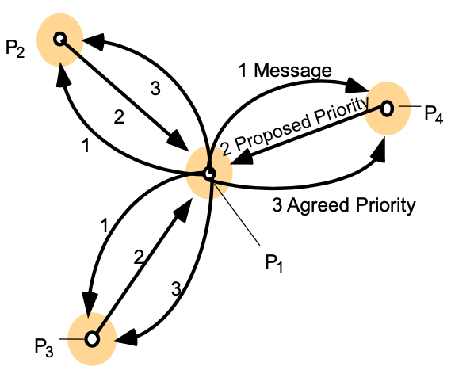

# Simple Decentralized Transaction Model

In this project, a simple decentralized transactrion model is implemented with ***Total Ordering Multicast***. The model works under ***majority*** manner to guarantee agreement and integrity. 

### Model Design

The simple model is designed with 2 layers

- **Multicast Layer**: responsible for guaranteeing Total Order Multicast and delivering message to transaction layer
- **Transaction Layer**: responsible for processing transactions delivered from Multicast Layer and logging

### Total Order Multicast

***Total Order Multicast*** is designed by utilizing TCP reliable unicast and ISIS algorithm, and will satisfy:

- If a correct process delivers message `m` before `m` then any other correct process that delivers `m'` will have already delivered `m`

The mechanism is designed based on **ISIS Algorithm** as shown here:



As nodes may fail, ***majority*** principle is leveraged. When a node receives `Proposed Priority` from a majority of nodes, it will generate `Agreed Priority` and deliver current message to transaction. Hence, the model will keep working under the following scenario:

- $N$ nodes
- $N/2-1$ failed nodes

### Transaction

The transaction is not fully implemented. The transaction can be customized.

### Model Usage

I extend it with containerization. To use it:

```shell
# build image first
docker build -t node-img . -f Dockerfile

# leverage docker compose
docker-compose up

# stop the model
docker-compose down
```

The current model configuration simulates 4-node decentralized transaction. To add more nodes, `config/` and `docker-compose.yml` need to be modified and the docker image needs to be rebuilt.		

### Problem and Progress

There are some light problems that I am working on:

- The log files in `logs/` may differ in the end. Some node has one or two more logs than others.
  - The problem is caused because the containers may not be terminated at the same stage.
- Thread liveness and safety are not fully guaranteed. 
  - Currently a synchronized queue is implemted to guarantee thread safety.
- Transaction application is not implemented.


